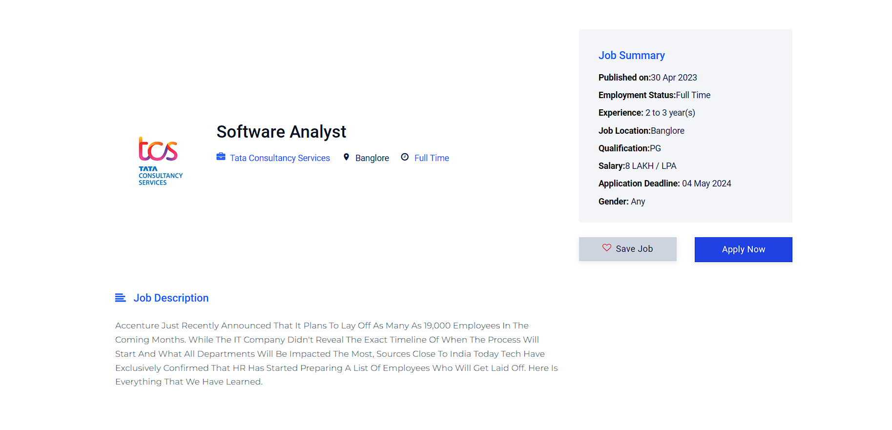

# Job Grids

#####  Job Grids is a web application that helps job seekers find job opportunities based on their skills and experience. The application is built using Django in the backend     and HTML, Bootstrap, and JavaScript in the frontend.

## Features
##### # Job search based on keywords and location 
##### # User registration and login 
##### # Resume upload and management 
##### # Job application tracking 
##### # Job recommendations 
##### # Add Reviews About JobGrids
##### # Customized Django Admin Panel

## Installation
### To install the application, follow these steps:

##### 1. Navigate to Terminal (Command Prompt)
##### 2. Navigate to the virtual enviroment : venv\Scripts\activate
##### 3. Navigate to the project directory: cd seekerp 
##### 4. Install the required dependencies: pip install -r requirements.txt 
##### 5. Create the database: python manage.py migrate 
##### 6. Run the development server: python manage.py runserver

## Admin Panel Credentials
#### username:admin 
#### password:admin

## Usage
##### To use the application, open a web browser and navigate to http://localhost:8000/. You should see the home page of the application. From here, you can search for jobs, create an account, and upload your resume.

## ScreenShots Of Job Grids

### Here's a screenshot of the Job Grids Homepage:

### All Jobs Section:

### Testimonials Section

### Login

### Apply a job

### Job Seeker Home Page

## Job Provider Home Page

# Credits
This application was created by **Animesh Thomas.**
##### For any contact: **animeshthomas262@gmail.com**

