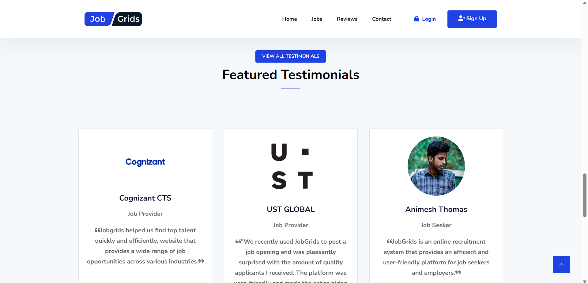
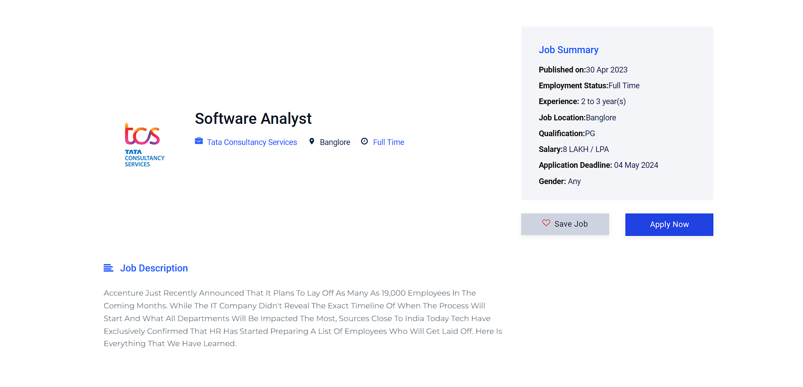

# 💼 JobGrids — Modern Django Job Portal & Recruitment System

<p align="center">
  
  
  
  
  
  
</p>

> **JobGrids** is a full-stack, enterprise-grade job portal and recruitment management platform powered by **Django** and a modern **Dark Glassmorphism UI**. Features multi-tenant portals for **Job Seekers**, **Job Providers (Employers)**, and **Super Admins** (`django-admin-volt`).

🌐 **Live Production Deployment**: [https://jobgrids-django.onrender.com/](https://jobgrids-django.onrender.com/) *(Or deploy your own in 1 click!)*

---

## ✨ Key Features

- **🎨 Modern Dark Glassmorphism UI System**: High-impact hero section, glowing search cards, salary badges, and job-type pills (*Full-time, Remote, Contract*).
- **👔 Dual Portal Portfolios**:
  - **Job Seeker Portal**: Resume creator, 1-click application tracking, status updates, and review submission.
  - **Job Provider (Employer) Portal**: Company profile management, job posting creation, applicant review, and candidate selection.
- **⚡ Admin Volt Management Dashboard**: Customized Bootstrap 5 admin dashboard (`/admin/`) for company verification, job approvals, and site analytics.
- **🔍 Advanced Search & Filtering**: Instant search across keywords, job categories, locations, and salary packages.
- **☁️ Cloud & Production Ready**: Pre-configured with **WhiteNoise** static asset handling and **Gunicorn** WSGI execution for 1-click deployment on **Render** or **Vercel**.

---

## 🔑 Pre-Configured Test User Credentials

### 1. 🛡️ Super Admin Panel (`/admin/`)
* **Admin Login Route**: `/admin/`
* *Access superuser management via `python manage.py createsuperuser` or environment credentials.*

### 2. 🏢 Job Provider (Employer) Accounts
| Company Name | Login Email | Password | Verification Status |
| :--- | :--- | :--- | :--- |
| **Google** | `google@gmail.com` | `google` | ✅ Verified |
| **Amazon Web Services (AWS)** | `aws@gmail.com` | `aws` | ✅ Verified |
| **Open AI** | `openai@gmail.com` | `Openai@123` | ✅ Verified |
| **TCS** | `tcs@gmail.com` | `Tcs@1234` | ✅ Verified |
| **Accenture** | `accenture@gmail.com` | `accenture` | ✅ Verified |
| **Cognizant (CTS)** | `cts@gmail.com` | `cts` | ✅ Verified |

### 3. 👤 Job Seeker Accounts
| Candidate Name | Login Email | Password | Account Type |
| :--- | :--- | :--- | :--- |
| **Animesh Thomas** | `animesh@gmail.com` | `animesh` | Candidate / Seeker |
| **Animesh Kurian Thomas** | `ani@gmail.com` | `ani45678` | Candidate / Seeker |
| **Thomas Mathew** | `thomas@gmail.com` | `Thomas@124` | Candidate / Seeker |
| **Aleesha Jaleel** | `aleesha@gmail.com` | `Aleesha@` | Candidate / Seeker |

---

## 🚀 Quick Start (Local Setup)

### 1. Clone the Repository
```bash
git clone https://github.com/animeshthomas/JobGrids-Django.git
cd JobGrids-Django
```

### 2. Install Dependencies
```bash
pip install -r requirements.txt
```

### 3. Run Database Migrations & Start Server
```bash
cd seekerp
python manage.py migrate
python manage.py runserver
```

Open **`http://127.0.0.1:8000`** in your browser!

---

## ☁️ Deployment Guide

### Deploying to Render (Recommended)
1. Log in to [Render.com](https://render.com) and click **New +** ➔ **Web Service**.
2. Connect this repository: **`animeshthomas/JobGrids-Django`**.
3. Configure settings:
   - **Root Directory**: `seekerp`
   - **Environment**: `Python 3`
   - **Build Command**:
     ```bash
     pip install -r ../requirements.txt && python manage.py collectstatic --noinput && python manage.py migrate
     ```
   - **Start Command**:
     ```bash
     gunicorn seekerp.wsgi:application
     ```

### Deploying to Vercel
1. Import repository on [Vercel.com](https://vercel.com).
2. Set **Root Directory** to `seekerp`.
3. Vercel will process `vercel.json` automatically!

---

## 📸 Screenshots

| Homepage | All Jobs Section |
| :---: | :---: |
|  |  |

| Testimonials | Candidate Application |
| :---: | :---: |
|  |  |

---

## 📄 License & Credits

Created with ❤️ by **[Animesh Thomas](https://github.com/animeshthomas)**. Distributed under the MIT License.
